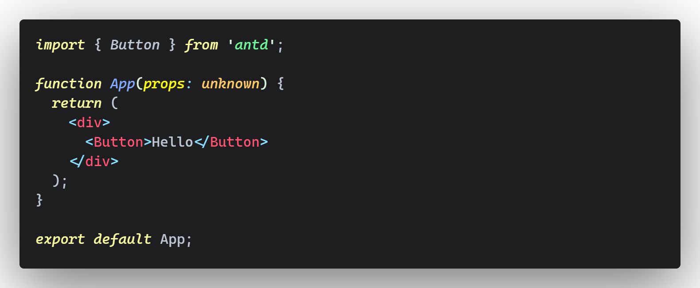
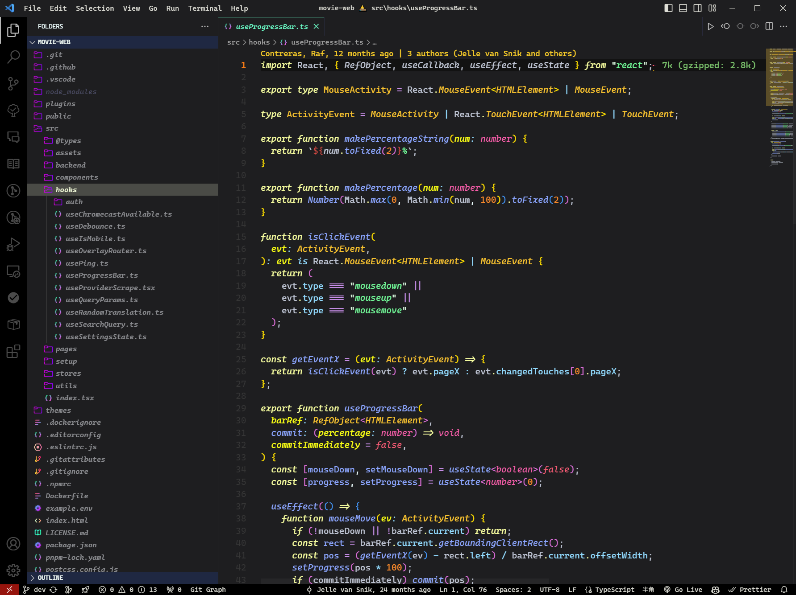
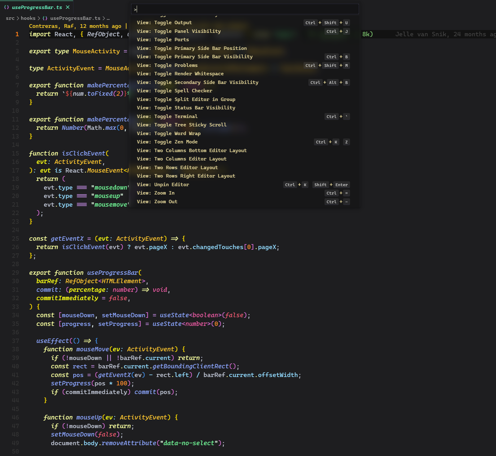
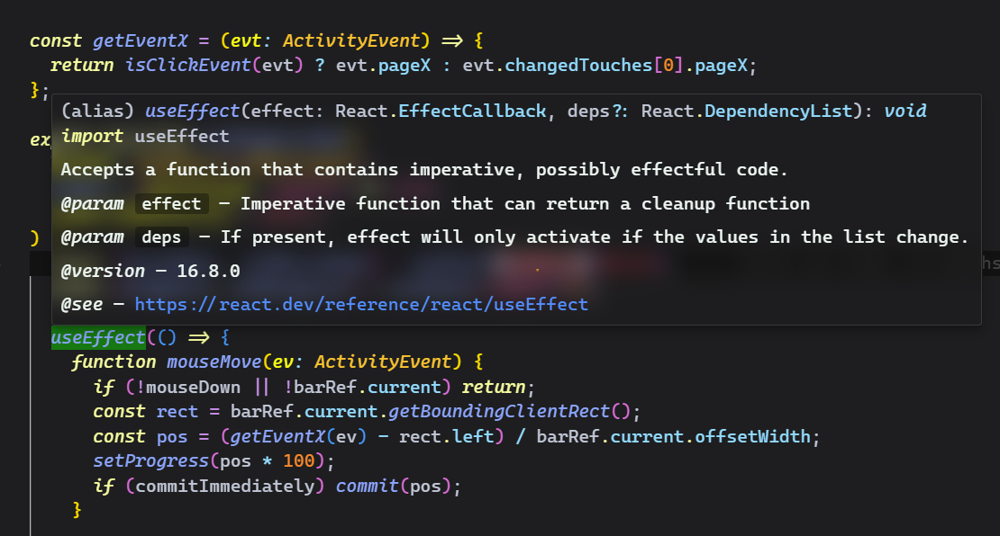

# 🎉Fog Hazy

🎇Enjoy the new interface, novelty and consistency!





💡If you want to experience the acrylic modal effect, you need to use the [Apc Customize UI++](https://marketplace.visualstudio.com/items?itemName=drcika.apc-extension) extension and configure the following CSS code:

> Apc Customize UI++ version <= 1.91

```json
"apc.stylesheet": {
    // acrylic effect
    ".quick-input-widget,.editor-widget,.suggest-details-container,.monaco-dialog-box,.monaco-hover,.rename-box": {
      "transform": "translateZ(0)",
      "-webkit-transform": "translateZ(0)",
      "backdrop-filter": "blur(10px) !important"
    },
    ".monaco-menu-container,.context-view.fixed,.context-view.fixed > .monaco-scrollable-element,.context-view .workbench-hover-pointer::after,.token-inspect-widget,#settingsWidget.active": {
      "transform": "translateZ(0)",
      "-webkit-transform": "translateZ(0)",
      "backdrop-filter": "blur(15px) !important"
    },
    // modal shadow
    ".quick-input-widget,.editor-widget,.suggest-details-container,.monaco-dialog-box,.monaco-hover,.monaco-menu-container,.monaco-workbench.context-menu-visible,.token-inspect-widget,#settingsWidget": {
      "box-shadow": "0 2px 2px rgba(0, 0, 0, 0.1), 0 5px 5px rgba(0, 0, 0, 0.1), 0 5px 15px rgba(0, 0, 0, 0.2) !important;"
    },
}
```

then you got it!





**Enjoy!**
